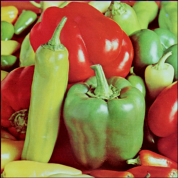

# Anti-aliasing-Filter
Apply anti-aliasing filter on an image to reduce image size while maintaining image quality to some extent.

Anti-aliasing filter: Process of improving the image quality when applying the decimation technique, by preprocessing the image with averaging (mean) spatial filter.

Input image:

Output image:

